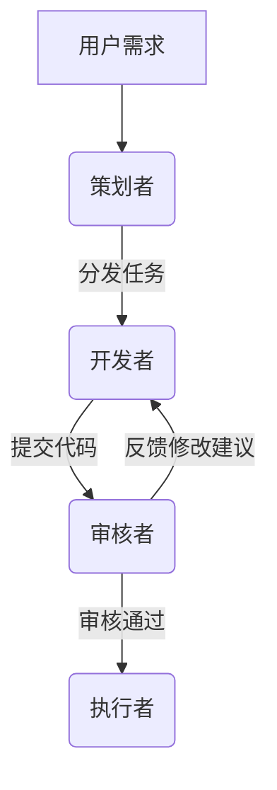
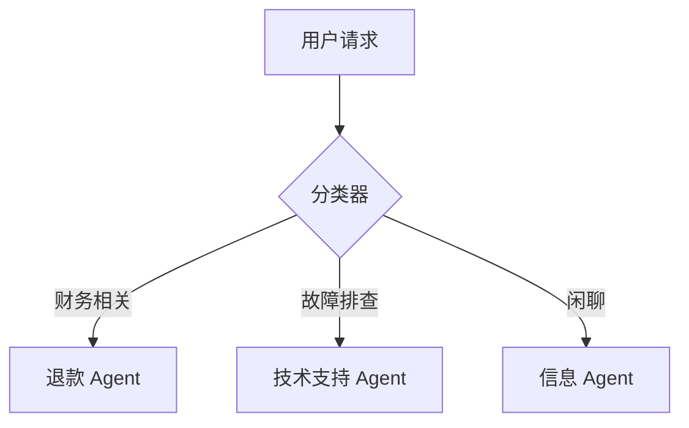
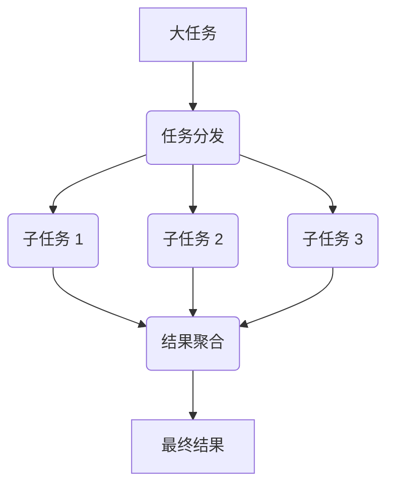
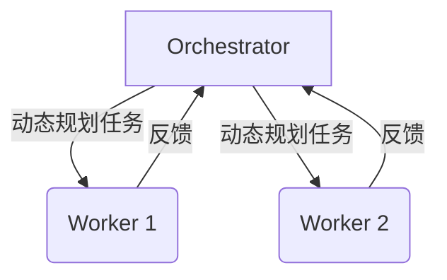
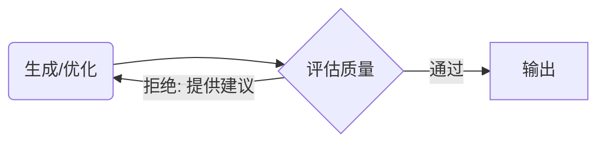
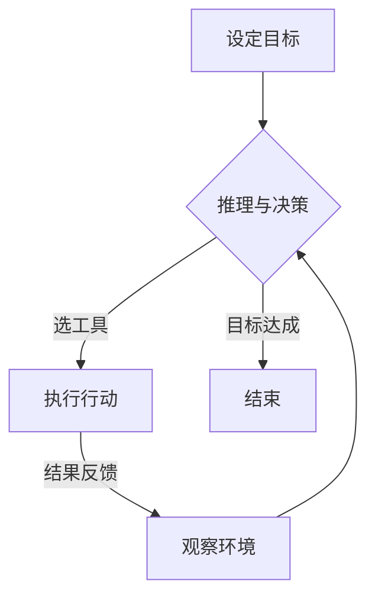

在生成式 AI 的落地过程中，我们正经历从“单一 Prompt”向“复杂工作流（Workflows）”及“智能体（Agents）”的范式转变。本文将深度拆解 Agent 系统的定义、常见演进形式以及 6 种核心设计模式。

---

## 一、 核心概念界定

根据 [Anthropic 的定义](https://www.anthropic.com/engineering/building-effective-agents)，我们可以将系统分为以下三类：

- **Agent Systems（智能体系统）**：广义概念。无论是完全自主的，还是预定义工作流的 Agent，都统一归为此类。

- **Workflows（工作流）**：使用**预定义流程**编排 LLM 与工具。逻辑在编码阶段确定，适合高可靠、可预测的任务。

- **Agents（智能体）**：由 LLM **自主规划**任务步骤。其核心特点是能够观察上一个步骤的执行结果（Observation），通过推理（Reasoning）决定后续操作，直到任务完成。

---

## 二、 工作流的演进形式

工作流的复杂程度决定了系统的灵活性与可控性。

### 1. 静态工作流 (Static / Prompt-Based Workflow)

- **特点**：工作流逻辑完全编码在提示词（prompt）中，如通过角色设定、步骤指令、输出格式约束等“写死”执行顺序。

- **优点**：简单、可复现、适合固定任务。

- **局限**：缺乏灵活性，无法根据中间结果动态调整。

- **典型场景**：单轮代码生成、模板化脚本生成。

*这类方法常作为基础模式出现在早期 Agent 设计中 。*

### 2. 提示链 (Prompt Chaining)

- 特点：将复杂任务拆解为多个子任务，每个子任务由一个独立的 prompt 处理，前一个输出作为后一个输入。

- 优势：比单 prompt 更可控，支持阶段性验证。

- 示例：需求解析 → 架构设计 → 模块生成 → 单元测试。

*被列为 Agentic Workflow 的核心设计模式之一 。*

### 3. 动态编排 (Dynamic Orchestration)

- **特点**：工作流结构在运行时生成或调整，而非预先定义。Agent 根据任务理解、执行反馈或环境状态，自主决定下一步操作。

- **关键技术**：

  - 子任务分解（task decomposition）

  - 工具选择（tool selection）

  - 甚至动态生成新 Agent 或工具代码 。

- **优势**：适应复杂、开放域任务，如“修复一个未知 bug”。

*被称为“新范式”，代表从“静态 pipeline”向“自主系统”的演进 。*

### 4. 多智能体协作 (Multi-Agent Collaboration)

- **特点**：多个具有不同角色（如 Planner、Coder、Reviewer、Executor）的 Agent 协同工作，通过消息传递或共享记忆协调。

- **工作流形式**：可静态预设（如固定角色流水线），也可动态协商（如基于对话的分工）。

- **工程实践**：已有模块化框架支持 memory、tool integration 和 orchestration 。

### 5. 混合模式 (Hybrid)

- 结合静态模板与动态决策。例如：

  - 主干流程固定（如“生成 → 测试 → 修复”循环），

  - 但每个阶段内部采用动态策略（如测试失败时自动选择修复策略）。

*这是当前工业界落地的主流方向，兼顾可控性与灵活性 。*

### 总结

| 工作流形式 | 是否动态 | 适用场景 | 代表技术 |
| --- | --- | --- | --- |
| Prompt 写死 | 否 | 简单、固定任务 | 静态 Prompt |
| Prompt Chaining | 否/弱动态 | 分阶段可控任务 | 链式调用 |
| 动态编排 | 是 | 开放、复杂、未知任务 | 自主任务分解、工具生成 |
| 多智能体协作 | 可动态 | 需要角色分工与验证的场景 | Planner-Coder-Reviewer |

---

## 三、 Agentic Workflow：6 种核心设计模式

### 概念

什么是Agentic Workflow：

Agentic Workflow可以翻译为智能体工作流\代理工作流\能动工作流，核心是一个智能体系统，其中多个AI Agent通过利用自然语言处理 （NLP） 和大型语言模型 （LLM） 协作完成任务。这些智能体能够自主感知、推理和行动，以追求特定目标，形成强大的集体智慧，可以打破孤岛，集成不同的数据源，并提供无缝的端到端自动化。

[什么是Agentic AI？什么是Agentic Workflow？与AI Agent有什么区别和联系？一篇文章看明白 - 知乎](https://zhuanlan.zhihu.com/p/705935464)

### 1. Prompt Chaining (提示链)

- **思想**：将用户请求拆解为一系列小的、顺序执行的步骤——就像拼装玩具一样，一次只拼一块。每一步的输出作为下一步的输入。

- **权衡**：

  - 优点：

    - 精度高，因为每个阶段聚焦单一任务。

    - 更容易排查问题：如果第2步失败，能立刻定位问题所在。

    - 每步输入给大语言模型（LLM）的内容更小，无需担心上下文长度限制。

  - 缺点：

    - 响应时间更长：需要连续多次调用。

    - 成本随步骤增加而上升。

    - 需要手动管理各步骤之间的数据传递。

- **示例**：

  1. 生成大纲。

  2. 检查大纲是否符合特定规则。

  3. 写下每个部分。

  4. 改进风格。

### 2. Routing (路由)

- **思想**：在流程开始时进行快速分类，决定将任务分配给哪个智能体或子工作流——就像图书管理员引导你到正确的书架区域。

- **权衡**：

  - **优点**：

    - 职责划分清晰。

    - 若跳过未使用的路径，执行速度更快。

  - **缺点**：

    - 分类必须准确，否则结果质量会下降。

    - 构建多个专用智能体耗时较长。

    - 需要额外增加一个分类步骤（即分类器本身）。

- **示例**：

  - 退款问题交给“退款智能体”。

  - 技术问题交给“支持智能体”。

  - 一般咨询交给“信息智能体”。

### 3. Parallelization (并行化)

- **思想**：将一个大任务拆分为多个小任务并行处理。想象把一本800页的书分给三位朋友，每人总结自己负责的部分，最后你再整合所有摘要。

- **权衡**：

  - **优点**：

    - 若任务真正并行执行，则速度更快。

    - 多样化的尝试可带来更全面的覆盖。

  - **缺点**：

    - 合并结果可能很复杂。

    - 如果每个分支都调用LLM，会消耗更多计算资源。

    - 各分支结果可能冲突，增加最终整合的复杂性。

- **示例**：

  - 通过拆分文档来总结超长文本。

  - 尝试多种解决方案（如投票机制），然后选择最优结果。

### 4. Orchestrator–Workers (编排器-工作者)

- **思想**：一个“管理者”LLM负责拆解子任务，分派给不同的“工作者”执行，再将结果整合——就像项目经理协调团队成员完成项目。

- **权衡**：

  - **优点**：

    - 高度灵活：编排器可动态决定任务分配。

    - 能很好地扩展以处理大量子任务。

  - **缺点**：

    - 开销较大：编排器需持续跟踪各任务状态。

    - 若工作者之间存在依赖，调试会变得复杂。

    - 额外步骤可能增加延迟。

- **示例**：

  - 在单次代码合并请求（PR）中编辑多个文件，每个文件由独立的工作者处理。

  - 从多个来源收集参考资料，再统一整合。

### 5. Evaluator-Optimizer (评估器-优化器)

- **思想**：系统包含两个主要角色：一个提出解决方案（优化器），另一个对其进行评估（评估器）。这就像学生反复修改草稿，老师不断批改，直到达到可接受的标准。

- **权衡**：

  - **优点**：

    - 每次迭代都更完善。

    - 错误在最终输出前就被发现。

  - **缺点**：

    - 耗时较长：需要多次来回交互。

    - 成本至少翻倍，因为每次迭代都涉及两次LLM调用。

    - 若评估标准不明确，可能导致无限循环。

- **示例**：

  - 起草营销文案，再由另一个LLM检查其清晰度或语气。

  - 对答案进行多次事实核查，确保准确性。

### 6. Autonomous Agent (自主智能体)

- **思想**：这是最灵活的模式。智能体自行决定每一步该做什么、何时停止——就像一个自主行动的机器人，在完成任务前不断探索和调整。自主智能体是一个完全自我驱动的系统，能够反复做决策。它自主选择下一步调用哪些工具、何时终止、循环多少次。这是一种持续的“行动–检查”循环，而非我们在增强型LLM（Augmented LLM）模式中看到的单次调用响应。

- **权衡**：

  - **优点**：

    - 能实时适应变化，应对意外情况。

    - 潜力巨大，可能展现出极高的创造力或彻底性。

  - **缺点**：

    - 若陷入无限循环，可能导致高昂费用或永不终止。

    - 调试困难：执行路径不固定。

    - 若缺乏安全检查机制，错误可能不断累积放大（雪球效应）。

- **示例**：

  - 一个AI代码修复工具，持续修改代码直到所有测试通过。

  - 一个问题求解器，在过程中动态尝试不同的工具或策略。

---

## 四、 总结与对比

| 工作流形式 | 是否动态 | 适用场景 | 代表性优势 | 局限性 |
| --- | --- | --- | --- | --- |
| **Prompt Chaining** | 否/弱动态 | 分阶段、高可靠任务 | 精度高，易于调试 | 响应慢，需管理状态 |
| **Routing** | 否 | 分类清晰的多业务场景 | 职责明确，节省资源 | 依赖分类准确率 |
| **Parallelization** | 是 | 海量数据、多方案比选 | 速度快，覆盖面广 | 结果聚合逻辑复杂 |
| **Orchestrator** | 是 | 复杂、需动态拆解的任务 | 灵活性极强 | 编排成本与延迟高 |
| **Evaluator-Optimizer** | 是 | 追求极致质量的创作 | 自动修正错误 | 成本极高，有死循环风险 |
| **Autonomous Agent** | 是 | 开放、未知、探索性任务 | 实时适应变化 | 路径不可控，成本难测 |
